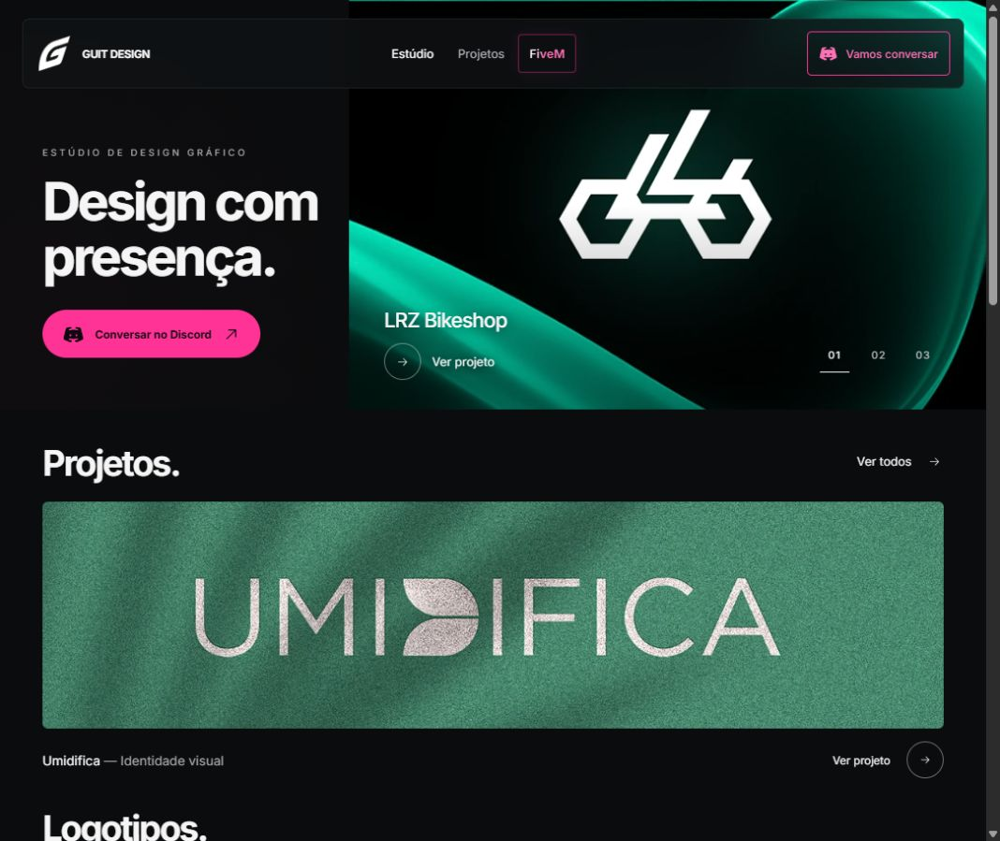
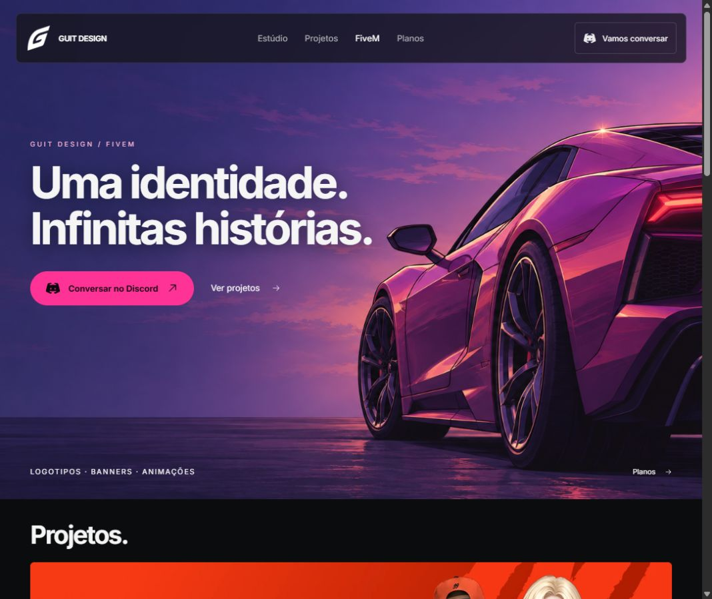
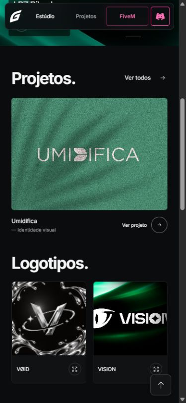
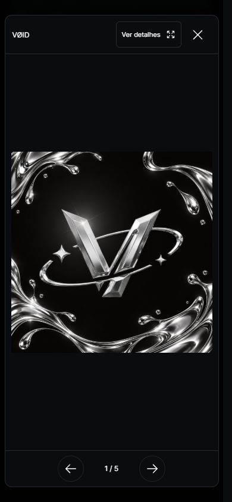
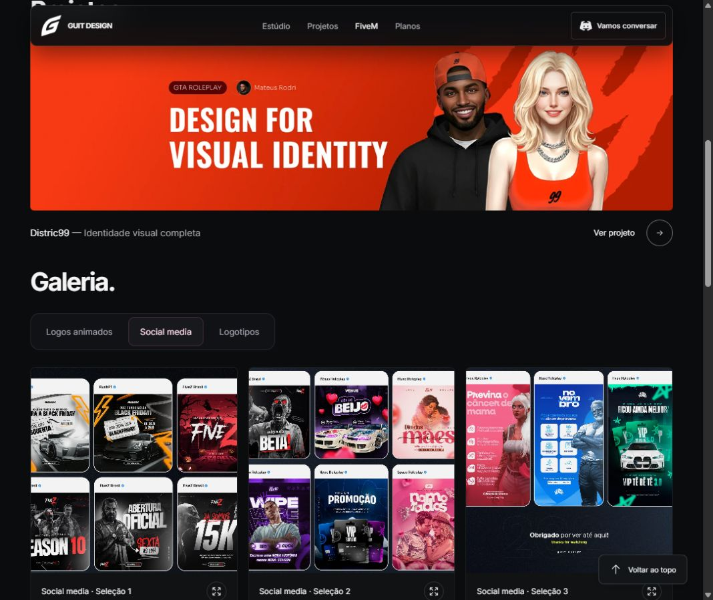
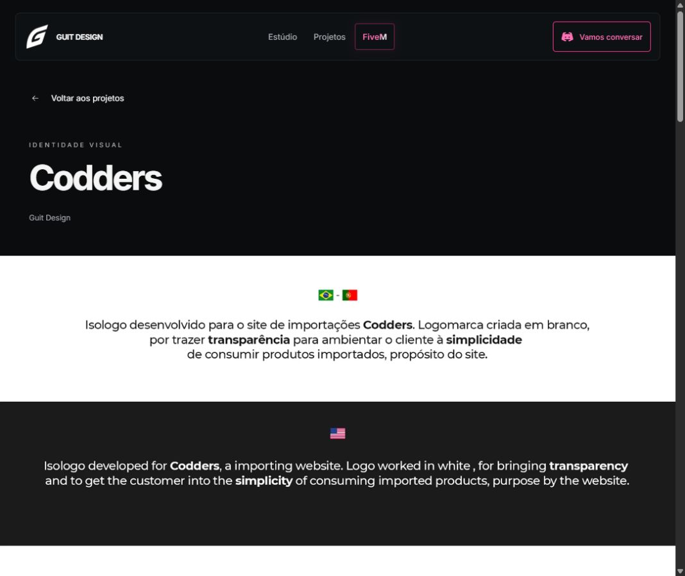
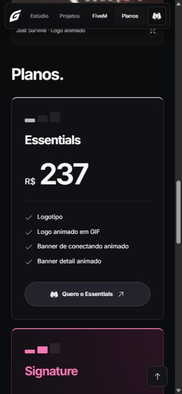
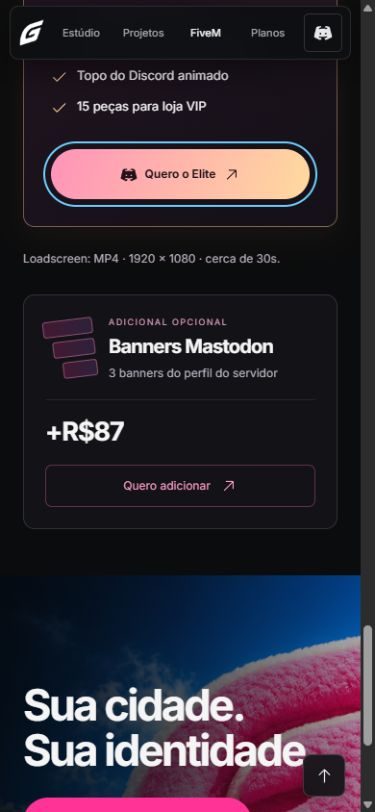

# Revisão do portfólio Guit Design

Escopo: home, FiveM, navegação, galerias, projeto Codders, planos, contato e rodapé. Capturas desta revisão no navegador local, em desktop e em 390 × 844. Alterações aplicadas ao protótipo, sem publicação.

## 1. Abertura e navegação — boa, estabilidade corrigida

A composição dividida da home e a ilustração FiveM comunicam áreas distintas com pouco texto. O menu agora reserva seu espaço ao ficar fixo, evitando deslocamentos no conteúdo. O contato com ícone tem nome acessível e os destinos internos têm margem para o cabeçalho. O hero recebeu transição de opacidade nas trocas manuais.

## 2. Projetos e miniaturas — falha mobile corrigida

Uma regra antiga escondia a última imagem do destaque Umidifica. Como agora há apenas uma, o banner inteiro desaparecia no celular. Corrigido. As legendas antes sobrepostas agora ficam abaixo das imagens, numa base uniforme. Ajustados cantos, títulos e áreas de toque. Mantido o cover dos logotipos gerais conforme aprovado; a galeria mostra o original inteiro.

## 3. Galerias e projetos completos — funcionamento conferido

O diálogo abre com a arte inteira ajustada à tela. “Ver detalhes” amplia e “Ajustar” retorna ao enquadramento completo. A próxima imagem reinicia o zoom. Testados troca de imagem e Escape. Os filtros FiveM receberam base única e seleção rosa discreta. Conferidos Social media, Logotipos, Ver todos, seleção Codders no hero e sua página completa, com créditos preservados.

## 4. Planos e adicional — leitura refinada

Preservada a progressão neutro → rosa → dourado, os valores e as inclusões. Adicionada uma separação discreta entre preços e listas. Cartões aparecem com uma entrada curta e ganham destaque de borda no hover. O adicional Mastodon agora tem descrição, preço e botão em linhas próprias no celular. Os links levam ao Discord, sem simular um carrinho de compras.

## 5. Contato, rodapé e movimento — refinados

Melhorado o contraste sobre a imagem de contato e o espaço dos links no rodapé mobile. O botão de voltar ao topo continua evitando o copyright, acompanhando o rodapé sem atraso de transição. Entradas de seções e cartões acontecem uma vez, com deslocamento de 14 px. Setas, filtros e botões têm respostas pequenas. Motion e CSS respeitam movimento reduzido.

## Validação e limites

- Build de produção sem erros.
- Consulta ao console da página de projeto sem erros ou avisos.
- Sem overflow horizontal em 390 px nas telas verificadas.
- Sem títulos vazios ou links sem nome na checagem estrutural do FiveM.
- Conferidos galeria, zoom, Escape, filtros, hero, expansão de projetos e destinos dos links de contato.
- Não houve auditoria completa com leitor de tela, contraste formal de todas as artes, aparelho físico ou rede móvel lenta. GIFs fornecidos continuam animados; movimento reduzido controla as animações da interface, não o conteúdo desses arquivos.
- Artes com texto incorporado mantêm as limitações do original e não foram redesenhadas.

Resultado: revisão aplicada e validada localmente.
